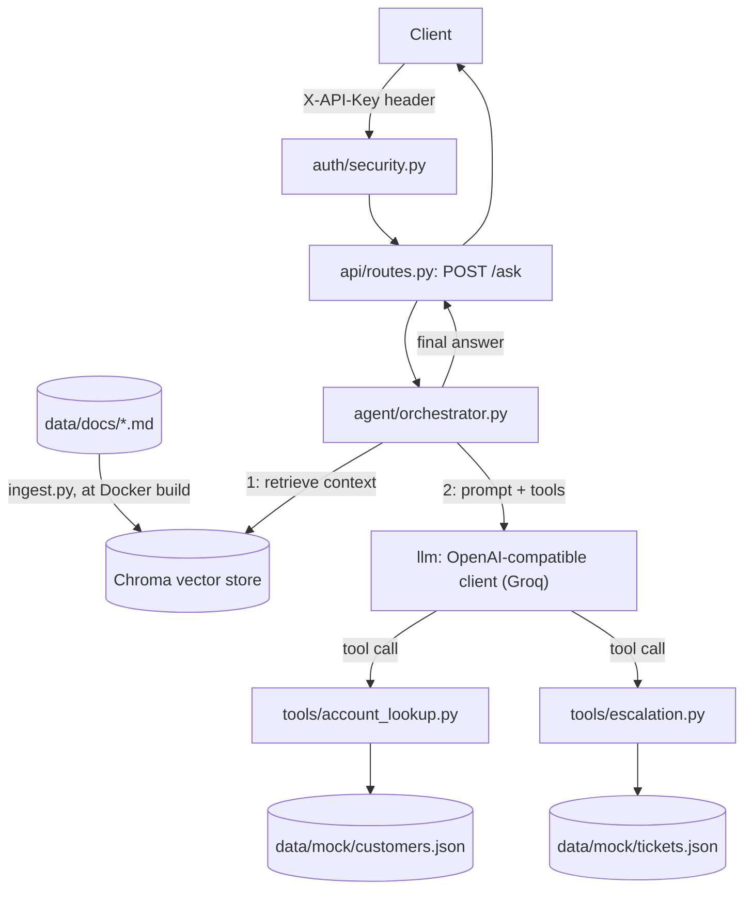

# Enterprise AI Customer Success Assistant

[](https://github.com/kritikagarwal-9/Enterprise-AI-Assistant/actions/workflows/ci.yml)

An internal AI assistant for a B2B SaaS company's Customer Success team.
It answers product questions from internal documentation, looks up a
customer's account through a mock CRM tool, and escalates billing or
contract issues to a human by opening a mock support ticket, deciding on
its own, per question, which of those three things to do.

Beyond the LLM call itself, the project covers retrieval, tool-calling
and agent decision logic, business rules for what the assistant can and
can't do on its own, human-in-the-loop escalation, an evaluation harness,
structured logging, Docker packaging, CI, and deployment.

**Live deployment:** https://enterprise-ai-assistant-s76o.onrender.com/
**API docs (Swagger UI):** https://enterprise-ai-assistant-s76o.onrender.com/docs

## What the assistant can do

- **Answer product questions** grounded strictly in CloudBoard's internal
  docs (plans, pricing, billing policy, release notes, support scope).
  It never uses the model's general knowledge, and it says so explicitly
  when an answer isn't in the retrieved documents.
- **Look up a customer's account** (plan, seat usage, status) via a mock
  CRM tool, when a question depends on that customer's specific account.
- **Escalate to a human** for billing disputes, refund requests, contract
  changes, and complaints, by opening a mock support ticket instead of
  attempting to resolve them itself.
- **Refuse what's out of scope**: legal advice, security/exploit
  requests, and anything unrelated to CloudBoard.

Which of these happens for a given question isn't hardcoded; it's a
decision the LLM makes per request, given a system prompt and two tools
(`lookup_account`, `escalate_to_human`). The orchestrator retrieves
context up front, exposes those tools, runs the tool-calling loop, and
maps whatever the model decides into a typed response.

## Architecture

Modular monolith: one FastAPI service, no microservices, no message
queue, no external state beyond a local vector store and two mock JSON
files standing in for a real CRM/ticketing system.



### Request flow

1. **Auth** (`app/auth/security.py`) checks the `X-API-Key` header against
   either the unrestricted staff key or a customer-scoped key. Everything
   past this point either has full access or is bound to one
   `customer_id`. See [Authentication & security](#authentication--security).
2. **Retrieval** (`app/rag/retrieve.py`) always runs first: the
   orchestrator fetches the most relevant chunks from the Chroma vector
   store (built from `data/docs` at Docker build time) before saying
   anything to the model, since most questions need that context
   regardless of whether a tool ends up being called too.
3. **The orchestrator** (`app/agent/orchestrator.py`) builds a system
   prompt plus the retrieved context, gives the model two tools
   (`lookup_account`, `escalate_to_human`), and runs a bounded loop
   (max 3 rounds) calling the LLM, executing whatever tool it asks for,
   and feeding the result back, until the model returns a final answer
   instead of another tool call.
4. **Tools** are plain Python functions, not real integrations:
   `lookup_account` reads `data/mock/customers.json`;
   `escalate_to_human` appends a ticket to `data/mock/tickets.json`. The
   model is never trusted to supply `customer_id` itself: it's injected
   server-side from the authenticated request, so the model can't look up
   or escalate on behalf of an account it wasn't asked about.
5. **The response** reports what actually happened: `action` is one of
   `answer`, `answer_with_account_context`, or `escalate`, plus the
   answer text, which doc sources were used, and a `ticket_id` if one was
   created.

## Tech stack

- **FastAPI**: the HTTP API (`/ask`, `/health`)
- **Chroma**: local, embedded vector database for RAG (no external
  vector DB service)
- **Groq**, via an OpenAI-compatible chat-completions client
  (`app/llm/openai_compatible.py`), swappable to any OpenAI-compatible
  provider through env vars, no code change needed
- **pydantic-settings**: all configuration from environment variables
- **pytest**: the test suite
- **Docker**: packaging, with RAG ingestion baked into the image at
  build time
- **GitHub Actions**: CI (tests, plus a Docker build and container
  smoke test)
- **Render**: deployment, Docker-based, auto-deploy from `main`

## Project structure

```text
app/
  main.py                FastAPI app, exception handlers, /health
  api/routes.py           POST /ask: auth, validation, response shaping
  agent/orchestrator.py   the tool-calling loop, the actual "agent" logic
  rag/                    ingest.py (chunking), retrieve.py, store.py (Chroma)
  tools/                  account_lookup.py, escalation.py (mock CRM/ticketing)
  auth/security.py        staff and customer-scoped API key handling
  core/                   config.py (env settings), logging.py (structured logs)
  llm/                    base.py, openai_compatible.py, factory.py
data/docs/       product docs and release notes used for RAG
data/mock/       fake customer accounts and support tickets
eval/            eval_questions.jsonl and run_eval.py, RAG/agent quality checks
tests/           57 pytest tests, one file per component
docker/Dockerfile
.github/workflows/ci.yml   test job, then a Docker build/smoke-test job
.github/dependabot.yml     weekly dependency update checks
```

## Authentication & security

Secrets (`LLM_API_KEY`, `API_AUTH_KEY`, `CUSTOMER_API_KEYS`) are configured
only via environment variables: `.env` locally (never committed; see
`.gitignore`), Render's dashboard in production, injected at container
runtime and never baked into the Docker image.

There are two API key types, both sent via the `X-API-Key` header:

- **Staff key (`API_AUTH_KEY`)**: unrestricted. This is an *internal*
  CS-team tool, and staff legitimately look up different customers all
  day, so this key intentionally has no per-customer restriction.
- **Customer-scoped keys (`CUSTOMER_API_KEYS`)**: for when a caller must
  be restricted to exactly one customer. Format:
  `key1:cust_001,key2:cust_002` (comma-separated `key:customer_id`
  pairs). A request authenticated with one of these keys is bound to that
  `customer_id`: it's filled in automatically if the request omits
  `customer_id`, and rejected with `403` if it names a different one.

A few other details:

- API key comparisons use `secrets.compare_digest` (constant-time).
- An unset staff key fails closed: it rejects every request rather than
  allowing them through.
- The request logger only records path, method, status, and duration,
  and never headers or bodies, so no secret ends up in the logs.
- The Docker build needs no secrets: ingestion only uses Chroma's local
  embedding model.
- `/ask` has no rate limiting. Given the small number of shared keys and
  low traffic, this hasn't been a priority; it would be the first thing
  to add if usage grew.

To rotate either key type: change the value in Render's dashboard and
redeploy.

## Running locally

macOS/Linux:

```bash
python -m venv .venv
source .venv/bin/activate
pip install -r requirements.txt
cp .env.example .env   # fill in LLM_API_KEY and API_AUTH_KEY
python -m app.rag.ingest   # builds the local Chroma store from data/docs
uvicorn app.main:app --reload
```

Windows (PowerShell):

```powershell
python -m venv .venv
.\.venv\Scripts\Activate.ps1
pip install -r requirements.txt
Copy-Item .env.example .env   # fill in LLM_API_KEY and API_AUTH_KEY
python -m app.rag.ingest      # builds the local Chroma store from data/docs
uvicorn app.main:app --reload
```

Then `POST /ask` with header `X-API-Key: <your API_AUTH_KEY>` and a JSON
body like `{"question": "What plans do you offer?"}`. Interactive API
docs are served at `/docs`.

### Environment variables

| Variable | Description |
|---|---|
| `LLM_API_KEY` | API key for the LLM provider. Required; `/ask` returns `503` if this is empty. |
| `LLM_PROVIDER` | LLM provider name (e.g. `groq`). Optional, defaults to `groq`. |
| `LLM_MODEL` | Model identifier to use. Optional, defaults to `openai/gpt-oss-20b`. |
| `LLM_BASE_URL` | Base URL for the provider's OpenAI-compatible API. Optional. If unset, it's resolved from `LLM_PROVIDER` (`groq` maps to Groq's API URL). |
| `API_AUTH_KEY` | Unrestricted staff key, checked against the `X-API-Key` header. Required; if unset, every request is rejected. |
| `CUSTOMER_API_KEYS` | Optional customer-scoped keys, format `key1:cust_001,key2:cust_002`. Only needed if you want keys restricted to a single `customer_id`; see [Authentication & security](#authentication--security). |

### Example request

A product question, answered from the retrieved docs:

```bash
curl -X POST http://localhost:8000/ask \
  -H "Content-Type: application/json" \
  -H "X-API-Key: your-api-key" \
  -d '{"question": "What plans do you offer?"}'
```

```json
{
  "answer": "CloudBoard offers three plans: Starter, Pro, and Enterprise...",
  "action": "answer",
  "sources": ["plans.md", "product-overview.md"],
  "ticket_id": null
}
```

A billing question, escalated to a human instead of answered directly:

```bash
curl -X POST http://localhost:8000/ask \
  -H "Content-Type: application/json" \
  -H "X-API-Key: your-api-key" \
  -d '{"question": "I was charged twice this month, please refund me.", "customer_id": "cust_001"}'
```

```json
{
  "answer": "I've forwarded this to a human billing specialist, who will follow up with you shortly.",
  "action": "escalate",
  "sources": ["billing.md"],
  "ticket_id": "tkt_3f9a2b1c8d"
}
```

On Windows PowerShell, use `curl.exe` rather than `curl` to get the real
curl binary; plain `curl` is aliased to `Invoke-WebRequest`, which
doesn't accept the same flags.

Every response carries an `X-Request-ID` header, useful for finding the
matching line in the structured logs. `question` is limited to 4000
characters; a longer value returns `422`.

## Testing

```bash
pytest
```

57 tests, one file per component, no live LLM calls (the LLM is faked or
mocked in every test): `test_account_lookup.py`, `test_api.py`,
`test_escalation.py`, `test_llm.py`, `test_orchestrator.py`, `test_rag.py`,
`test_security.py`. Coverage includes the tool-calling loop, escalation
and ticket creation, RAG chunking/retrieval (including the case that
release-note sections stay attached to their own version heading), both
API key types and the customer-scope boundary, request-ID correlation on
error responses, request validation limits, and every documented failure
mode (missing/invalid key, LLM not configured, upstream LLM failure,
malformed input, an unhandled exception).

## Evaluation harness

Unit tests check code paths with the LLM faked out. `eval/` checks
answer *quality* by running against the configured LLM directly.

```bash
python -m eval.run_eval
```

Runs every question in `eval/eval_questions.jsonl` (answerable/RAG,
refuse/out-of-scope, account-lookup, and escalation cases) through the
real orchestrator and a real LLM call, and grades each one against its
expected action and/or expected keywords. Needs a real `LLM_API_KEY`.
Escalation tickets created during a run go to `eval/eval_tickets.json`
(gitignored) rather than the real mock ticket data.

## Docker

```bash
docker build -f docker/Dockerfile -t enterprise-ai-cs-assistant .
docker run -p 8000:8000 --env-file .env enterprise-ai-cs-assistant
```

The image installs pinned dependencies, then runs RAG ingestion
(`python -m app.rag.ingest`) as a build step, so the vector store and
embedding model are already part of the image; the container doesn't
build or download anything at startup.

## CI/CD

GitHub Actions (`.github/workflows/ci.yml`) runs on every push and pull
request: a `test` job (pinned deps, full `pytest` suite), then a `docker`
job that builds the image from `docker/Dockerfile`, starts the container,
and polls `/health` to confirm it comes up. `.github/dependabot.yml`
checks weekly for pip and GitHub Actions dependency updates.

Render handles deployment itself, auto-deploying from `main` whenever
`docker/Dockerfile` builds successfully. There's no separate deploy step
in GitHub Actions; CI verifies the code and image, and Render ships them.

### Rollback

Render keeps a history of previous successful deploys. Redeploying an
earlier one from Render's dashboard rolls the live service back
immediately, without touching git. For a code-level rollback, reverting
the problematic commit on `main` (or resetting to a known-good commit)
triggers a normal auto-deploy of that reverted state, the same as any
other push.

## Production considerations

**Implemented:**

- Known failure points in the request path (corrupt mock data, a broken
  Chroma store, a ticket-write failure, an unhandled exception) return a
  clean, logged error response instead of crashing. Each case has a test.
- No hardcoded secrets in the codebase or git history. Constant-time API
  key comparison. Customer-scoped keys are bound to a single
  `customer_id` at the API layer and enforced on every request. Secrets
  are never logged and never baked into the Docker image.
- Structured logging: one JSON line per request to stdout (request ID,
  path, method, status, duration), with the same request ID attached to
  any error log line and returned in the response's `X-Request-ID`
  header for correlation.
- Input validation on `/ask`: a blank question is rejected, and
  `question` is capped at 4000 characters.
- CI runs the full test suite and a Docker build/container smoke test on
  every push.
- Deployed on Render (Docker, auto-deploy from `main`). Health, docs, and
  API-key rejection have been verified directly against the live
  deployment. The full request flow, including RAG answers, account
  lookup, and escalation, has been verified end-to-end locally and in the
  Docker build used for deployment.

**Intentionally out of scope:**

- Rate limiting; see [Authentication & security](#authentication--security).
- A frontend, database, or session/conversation memory: the API is
  stateless per request by design.
- OAuth/JWT: the two-key model covers the current use case without it.
- Multi-agent orchestration or Kubernetes: not needed at this scale.
